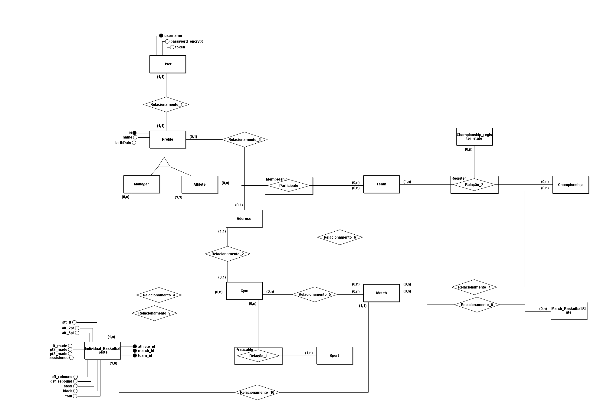

# Quatty

## Publico alvo

O publico alvo da aplicação são os jogadores de basquete do mais diversos tipos sejam amadores, estudantes ou profissionais.

### O que a aplicação busca resolver?

Existe uma dificuldade de comunicação entre os praticantes de esportes (basquete) para se reunir seja em locais públicos ou privados para a prática do esporte, além disso, após se reunirem existe uma dificuldade de gerenciamento das partidas no que diz respeito ao times, as estatísticas e o balanceamento das equipes.

- Onde está ocorrendo o problema?

O problema ocorre em encontros para prática de esportes dos mais diversos tipos, entretanto, o publico alvo para esse projeto vão ser os jogadores de basquete.

- Qual o impacto do problema?

Esse problema tem impacto na saúde e bem estar da sociedade no geral onde existe uma dificuldade em gerir partidas e campeonatos, além de encontrar praticantes do esporte com interesses em comum.

## Soluções oferecidas na aplicação
### Para todos
- Disponibilização de avaliação de jogadores, locais e equipes.
- Abertura de espaço para divulgação de peneiras.
### Para Jogadores
- Disponibilização de plataforma para visualização de estatísticas
- Falicitação na busca de locais para prática de esportes
- Facilitação de busca por rachas/equipes para treinar.
### Para equipes
- Registro de equipes
- Facilitação da busca por jogadores para completar equipes
- Falicitação na busca de locais para prática de esportes
- Disponibilização de plataforma para gestão de partidas e campeonatos
- Integração da comunidade a espaços publicos.
### Para gestores
- Disponibilização de plataforma para gestão de entrada e saída de pessoas
- Disponibilização de plataforma para manuteção de horarios e valores
- Dashboards de vendas/utilizações dos espaços

# Arquitetura do projeto

## Low level architecture

### Diagrama

Na imagem a seguir é apresentado como o projeto se comporta, qual a relação entre os pacotes, protocolo de comunicação entre a interface gráfica e parte logica da aplicação.

### Implementação

Na imagem abaixo é apresentado a estrutura do projeto e sua organização de pastas.

## Processo de release

### Etapas do processo de release.
1. A partir da branch de *DEVELOPMENT* é criado a branch para a task que será atuada na task da sprint do jira.
2. Após finalizado o desenvolvimento deve ser realizado uma Pull Request para a branch development.
3. A medida que os códigos são enviados para PR devem ser atribuidas pessoas para realizar o review onde em sua PR deve conter a descrição dos arquivos que foram alterados e por que foram alterados.
4. Com a finalização da sprint e realizado o code review de todas as funcionalidades criadas as mesmas são mergeadas para a branch *QA* onde será testada por usuários de diferentes tipos.
5. Caso passe nos testes de usabilidade e que as funcionalidades que foram estipuladas serem desenvolvidas na sprint estajam funcionando será realizado o merge para a branch principal *MAIN*
6. A versão em produção é disponibilizada para uso de todos os usuários.

## Diagrama de classes

O Diagrama de classes apresenta a estrutura de como será produzido o código independente de linguagem tornando fácil a compreensão de qualquer leitor.

Com o diagrama de classes podemos representar as funcionalidades que estão a ser construidas.

- O diagrama de classes se encontra em construção a medida que o projeto evolui ele é incrementado e versionado.
### Versão Atual 2.0

O diagrama a seguir mostra como está relacionado o desenvolvimento do sistema de forma completa tendo como pespectiva o que foi desenvolvido até então.

## Modelo de entidade e relacionamento

Com a utilização de um modelo entidade e relacionamento é possivel identificar como as entidades vão estar dispostas no banco de dados, seus relacionamentos e realizar a normalização das mesmas ganhando performace.

- Assim como o diagrama de classes o modelo de entidade e relacionamento é alterado a medida que o projeto cresce. 
### Versão Atual 2.0

## Diagrama de caso de uso

Esse diagrama trás uma visão macro do sistema como os atores podem utilizar-los.

## Diagramas de sequência

Os diagramas de sequência são utilizados para representar como o usuário interage com o sistema e como funciona a comunicação interna do sistema independente de linguagem de programação, é utilizado para situações que contém estados mais complexos para melhorar o entendimento do programador que está a construir a funcionalidade especificada.